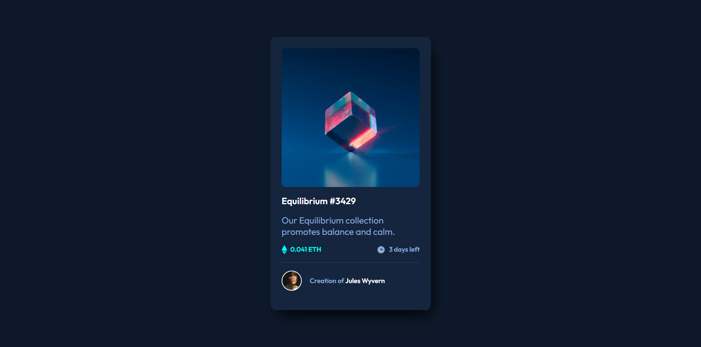

# Frontend Mentor - NFT preview card component solution

This is a solution to the [NFT preview card component challenge on Frontend Mentor](https://www.frontendmentor.io/challenges/nft-preview-card-component-SbdUL_w0U). Frontend Mentor challenges help you improve your coding skills by building realistic projects. 

## Table of contents

- [Overview](#overview)
  - [The challenge](#the-challenge)
  - [Screenshot](#screenshot)
  - [Links](#links)
- [My process](#my-process)
  - [Built with](#built-with)
  - [What I learned](#what-i-learned)
  - [Continued development](#continued-development)
  - [Useful resources](#useful-resources)
- [Author](#author)

**Note: Delete this note and update the table of contents based on what sections you keep.**

## Overview

### The challenge

Users should be able to:

- View the optimal layout depending on their device's screen size
- See hover states for interactive elements

### Screenshot



### Links

- Solution URL: [Solution](https://github.com/Issasoftdev/nft-preview-card-component)
- Live Site URL: [Live Site](https://issasoftdev.github.io/nft-preview-card-component/)

## My process

### Built with

- Semantic HTML5 markup
- CSS custom properties
- Flexbox
- Mobile-first workflow
- Vanilla Javascript

### What I learned

I decided to build the project without using any frameworks or libraries, inorder to practice my fundamental HTML and CSS. It really helps to examine the design, break it down mentally and try to visualize how I would code it and make it responsive aswell.

I got a better understanding of how Flexbox components work, in relation to other elements. I learnt more about using `rem` as a measurement unit and how powerful it can be. I

I had a bit of trouble using the css `:hover` to make the overlay appear which is nested inside my figure container, so I decided to use Javascript to do it. At first I struggled a bit, then I learnt about the `'mouseout'` event, which also needs to listened for along with the `'mouseover'` event:

```js
image.addEventListener('mouseover', function () {
    overlay.style.display = 'flex';
})

image.addEventListener('mouseout', function () {
    overlay.style.display = 'none';
})
```

It was a really fun project and I'm proud of myself, since I managed to do it within a day.

### Continued development

I feel as though I do need a bit more study and practice with HTML CSS and there's a lot that can be done with just the bare minimum.

### Useful resources

- [W3Schools](https://www.w3schools.com/) - This is a recource that helps me generally when I need a reminder, or to look up something. I recommend to any develpor, aswell as the MDN docs.
- [DelftStack](https://www.delftstack.com/howto/javascript/mouse-over-event-in-javascript/) - This is an amazing article which helped me finally understand the Mouseover Event in Javascript. I'd recommend it to anyone still learning this concept.

## Author

- Website - [Issa](https://issamzk.co.za)
- Frontend Mentor - [@Issasoftdev](https://www.frontendmentor.io/profile/Issasoftdev)
- Github - [Issasoftdev](https://github.com/Issasoftdev)
- Codepen - [@issamzk](https://codepen.io/issamzk)

